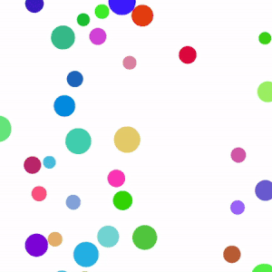

# @mantrelio/physics-engine

Lightweight 2D physics engine library built with TypeScript that is designed for basic physics simulations on your web application. 

## Installation
```bash
npm install @mantrelio/physics-engine
```

## Quick Start

```typescript
import { PhysicsEngine, RigidBodyFactory } from '@mantrelio/physics-engine';

// Create engine
const engine = new PhysicsEngine({ canvas: 'myCanvas' });

// Create objects
const circle = RigidBodyFactory.circle({
    radius: 20,
    position: [100, 100],
    mass: 1
});

const rectangle = RigidBodyFactory.rectangle({
    width: 100,
    height: 50,
    position: [200, 200],
    mass: 2
});

// Add to simulation
engine.addObject(circle);
engine.addObject(rectangle);

// Start simulation
engine.start();
```

## HTML Setup

```html
<!DOCTYPE html>
<html>
<head>
    <title>Physics Engine Demo</title>
</head>
<body>
    <canvas id="myCanvas" width="800" height="600"></canvas>
    <script type="module" src="main.js"></script>
</body>
</html>
```
**Note:** For browser usage, serve your files with a local server (e.g., `npx serve .`). Opening HTML files directly with `file://` will not work due to browser security restrictions.

## Features

This physics engine uses an HTML `<canvas>` element as the rendering surface, with the Canvas 2D API as the renderer.

- **Collision detection** is separated in to **broad-phase** and **narrow-phase** detection: <br> **Broad-phase collision detection** utilizes quadtree data structure to create a dynamic collision grid at run-time, preventing unnecessary collision checks and thus optimizing the overall performance of the physics simulations. <br> <br> **Narrow-phase collision detection** uses Seperating Axis Theorem to create an algorithm which determines whether two convex shapes are intersecting or overlapping <br> 

- **Collision resolution** is integrated via impulse-based reaction model method, widely used by most game physics. It can solve both rotational and linear motion collisions.

- **Dynamics** are handled by Velocity Verlet integration to create realistic motion and response to forces.

- Currently, the library supports only convex shapes and circles for **Rigid  bodies**.

- Has built in gravity, drag forces.

## API Documentation

### Core Classes
- `PhysicsEngine` - Main engine class
- `Cirlce` - Circular rigid body
- `Rectangle` - Rectangular rigid body
- `Vector` - 2D vector object with mutating methods
- `VectorMath` - Pure mathematical vector calculations

### Math Utilities

- `Vector` - 2D vector with mutating methods (modify the vector in place)
- `VectorMath` - Pure mathematical functions (return new vectors without modifying inputs)

### Factories
- `RigidBodyFactory` - Create physics objects

### Configuration Types
- `CircleConfig` - Configuration for circles
- `RectangleConfig` - Configuration for rectangles
- `PolygonConfig` - Configuration for polygons

### Creating Different Shapes

```typescript
// Circle
const ball = RigidBodyFactory.circle({
    radius: 25,
    position: [100, 100],
    mass: 1,
    velocity: new Vector(50, 0)
});

// Rectangle
const box = RigidBodyFactory.rectangle({
    width: 80,
    height: 40,
    position: [200, 200],
    mass: 2
});

// Static objects (won't move)
const ground = RigidBodyFactory.square({
    size: 20,
    position: [400, 580],
    mass: Infinity // Static object
});
```

### Vector Operations

```typescript
import { Vector, VectorMath } from '@mantrelio/physics-engine';

// Mutating operations (modify vector)
const vector = new Vector(10, 20);
vector.add(new Vector(5, 5));     // vector is now (15, 25)
vector.normalize();               // vector is now normalized

// Pure operations (return new vectors)
const v1 = new Vector(10, 20);
const v2 = new Vector(5, 5);
const sum = VectorMath.add(v1, v2);        // Returns new Vector(15, 25)
const normalized = VectorMath.normalize(v1); // Returns new normalized vector
```

## Browser Compatibility

- Modern browsers with ES2020 support
- Requires ES modules support
- Canvas 2D API support

## License

MIT

## Tech Stack
- **Language**: TypeScript 5.9.2
- **Build Tool**: TypeScript Compiler
- **Runtime**: Browser (ES2020+)
